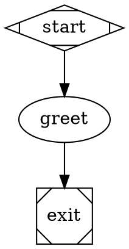
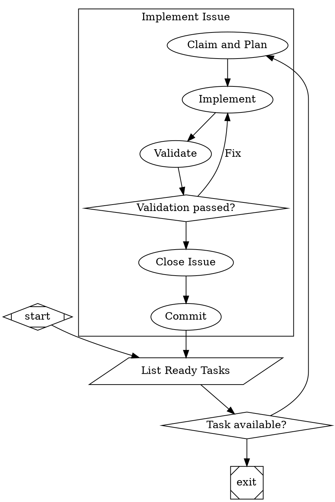

# `attractor-pi.dev`

This project hosts an implementation of the [StrongDM](https://www.strongdm.com/)'s [Attractor](https://factory.strongdm.ai/products/attractor), in Typescript.

The LLM backend uses [pi-mono](https://github.com/ArtificiallyIntelligent/pi-mono) by [pi.dev](https://pi.dev/) (pi-ai, pi-agent-core, pi-coding-agent).

# Attractor

Attractor lets you define multi-stage AI workflows as directed graphs using Graphviz DOT syntax. Each node is a task -- an LLM call, a human approval, a shell command, a conditional branch -- and edges define the flow between them. You write a `.dot` file; the engine traverses the graph.



Product page: [factory.strongdm.ai/products/attractor](https://factory.strongdm.ai/products/attractor)

## Install

```bash
npm install -g @jhugman/attractor-pi
```

Requires Node.js 20+.

## Use

```bash
# Check a pipeline for errors
attractor-pi validate workflow.dot

# Run a pipeline
attractor-pi run workflow.dot

# Run without LLM calls (simulation mode)
attractor-pi run workflow.dot --simulate

# Override variables declared in the DOT file
attractor-pi run workflow.dot --set feature=login --set env=prod
```

## What it does

The engine reads a `.dot` file, builds a directed graph, validates it, then walks the graph node by node:

1. Execute the current node's handler (LLM call, human gate, tool, etc.)
2. Evaluate edge conditions against the execution context
3. Select the next node
4. Save a checkpoint
5. Repeat until reaching the exit node

Pipelines support retries, goal gates, conditional branching, parallel fan-out/fan-in, human-in-the-loop approvals, per-node model configuration, and checkpoint/resume.

## Example

This pipeline implements issues from a backlog one at a time -- listing ready tasks, planning, implementing, validating, and committing in a loop:



Run it: `attractor-pi run pipeline.dot --set epic_id=E-42`

More examples in [`examples/`](examples/).

## Documentation

- [Language spec](docs/user/language-spec.md) -- full grammar, node shapes, attributes, edge conditions
- [CLI reference](docs/user/cli-reference.md) -- all commands and flags
- [Cookbook](docs/user/cookbook.md) -- recipes for common patterns
- [Cheatsheet](docs/user/cheatsheet.md) -- quick reference card

## How this differs from the spec

This implementation covers the core execution engine, parser, validation, and all node types. Two things from the [specification](docs/specs/attractor-spec.md) are not yet wired end-to-end:

- **Manager/supervisor loops** -- handler is fully coded, but the runner does not wire the observer, so it falls back to a no-op
- **Checkpoint resume from CLI** -- checkpoints are saved after every node; the runner supports `resumeFrom`, but the CLI does not expose a `--resume` flag yet

The spec checklists in [`docs/specs/`](docs/specs/) track what is and is not done.

This implementation adds:

- arguments which can be passed to the pipeline from the command line, and used in labels, prompts and tool calls.
- `@prompts/includes` for prompts, to allow for longer prompts.

## Architecture

Attractor is a TypeScript monorepo with three workspace packages:

| Package | Purpose |
|---------|---------|
| `@attractor/core` | Parser, graph model, validation, execution engine, handlers |
| `@attractor/backend-pi-dev` | LLM backend wrapping [pi-mono](https://github.com/ArtificiallyIntelligent/pi-mono) |
| `@attractor/cli` | CLI entry point |

The published `@jhugman/attractor-pi` package bundles all three into a single file, keeping only the pi-mono packages as external npm dependencies.

The core engine is backend-agnostic. The `CodergenBackend` interface (a single `run(prompt, options)` method) is the only contract between the engine and whatever calls the LLM. The `backend-pi-dev` package provides one implementation; you could write another.

## License

Apache-2.0. See [LICENSE](LICENSE).
