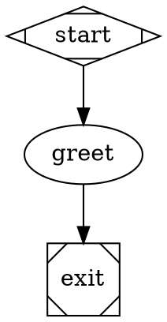
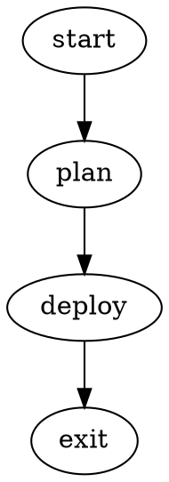

# Attractor DOT Cheatsheet

## Minimal Pipeline



## Node Shapes

```
Mdiamond        Start (entry point)
Msquare         Exit (terminal)
box             LLM task (default)
hexagon         Human gate
diamond         Conditional branch
component       Parallel fan-out
tripleoctagon   Parallel fan-in
parallelogram   External tool
house           Manager/supervisor loop
```

## Common Node Patterns

```dot
// LLM task (box is default shape)
plan [label="Plan", prompt="Plan the implementation of $goal"]

// LLM task with retry
implement [label="Implement", prompt="Write the code", max_retries=3]

// LLM task with timeout
review [label="Review", prompt="Review the code", timeout="1800s"]

// Goal gate -- must succeed before pipeline can exit
validate [label="Validate", prompt="Run tests", goal_gate=true]

// Human gate
approval [shape=hexagon, label="Approve?"]

// Conditional routing point
check [shape=diamond, label="Tests pass?"]

// External tool
run_tests [shape=parallelogram, label="Run Tests", tool_command="npm test"]
```

## Edge Patterns

```dot
// Unconditional
A -> B

// Labeled
A -> B [label="next"]

// Conditional on outcome
A -> B [condition="outcome=success"]
A -> C [condition="outcome=fail"]

// Conditional on tool output
A -> B [condition="tool.output contains \"PASS\""]

// Weighted (higher wins among equals)
A -> B [weight=10]
A -> C [weight=1]

// Chained (syntactic sugar)
A -> B -> C -> D [label="next"]
```

## Human Gate Edges

Use accelerator keys in edge labels for keyboard shortcuts:

```dot
gate [shape=hexagon, label="Review Changes"]
gate -> approve [label="[A] Approve"]
gate -> fix     [label="[F] Fix"]
gate -> reject  [label="[R] Reject"]
```

Recognized patterns: `[K] Label`, `K) Label`, `K - Label`.

## Condition Expressions

```dot
// Equality / inequality
[condition="outcome=success"]
[condition="outcome!=fail"]

// AND / OR
[condition="outcome=success && tool.output contains \"PASS\""]
[condition="outcome=success || outcome=partial_success"]

// NOT
[condition="!outcome=fail"]

// Substring (tool output or LLM response)
[condition="tool.output contains \"ERROR\""]
[condition="last_response contains \"error\""]

// Regex
[condition="tool.output matches \"PASS.*100%\""]

// Numeric comparison
[condition="internal.retry_count.implement >= 5"]

// Bare key (truthy -- non-empty string)
[condition="last_response"]
```

Precedence: `&&` binds tighter than `||`. No parentheses.

See "Context Keys" below for the complete list of keys available in conditions.

## Variables



CLI override: `attractor run deploy.dot --set feature=login --set env=prod`

Built-in variables:
- `$goal` -- from `graph[goal]`, available in DOT file and command files
- `$ARGUMENTS` -- only in `/command` `.md` files; value comes from text after the command name (e.g., `prompt="/rfc-to-plan RFC-006"` sets `$ARGUMENTS` to `RFC-006`)

## Prompt Resolution

```dot
// Inline text
plan [prompt="Plan the implementation"]

// File include (relative to .dot file)
plan [prompt="@prompts/plan.md"]

// Command lookup (searches .attractor/commands/)
plan [prompt="/rfc-to-plan RFC-006"]

// Namespaced command (: becomes /)
review [prompt="/my:careful-review"]
```

## Model Stylesheet

```dot
graph [
    model_stylesheet="
        * { llm_model: claude-sonnet-4-5; llm_provider: anthropic; }
        .code { llm_model: claude-opus-4-6; }
        #critical { llm_model: gpt-5.2; llm_provider: openai; reasoning_effort: high; }
    "
]

plan     [label="Plan", class="planning"]
code     [label="Code", class="code"]
critical [label="Critical Review"]
```

Specificity: `*` < `.class` < `#id` < explicit node attribute.

## Context Fidelity

```dot
// On a node
implement [fidelity="full", thread_id="main-loop"]

// On an edge (overrides target node)
plan -> implement [fidelity="full", thread_id="main-loop"]

// Graph default
graph [default_fidelity="compact"]
```

Modes: `full` | `truncate` | `compact` | `summary:low` | `summary:medium` | `summary:high`

## Subgraph Defaults

```dot
subgraph cluster_loop {
    label = "Inner Loop"
    node [thread_id="inner", timeout="900s", fidelity="full"]

    plan      [label="Plan"]
    implement [label="Implement", timeout="1800s"]  // overrides timeout
}
```

Nodes inherit subgraph defaults. Explicit attributes override. The subgraph label derives a CSS class (`inner-loop`).

## Retry and Failure

```dot
// Retry a node up to 3 extra times
implement [max_retries=3]

// Accept partial success when retries exhausted
implement [max_retries=3, allow_partial=true]

// Jump to a specific node on failure
implement [retry_target="plan"]

// Graph-level retry target
graph [retry_target="plan", fallback_retry_target="start"]

// Fail edge
implement -> fix [condition="outcome=fail", label="Fix"]
```

## Goal Gates

```dot
// Node must succeed before pipeline exits
validate [prompt="Run all tests", goal_gate=true, retry_target="implement"]

// If validate hasn't succeeded when exit is reached,
// the engine jumps to retry_target instead of exiting
```

## Context Keys (for Conditions)

Context keys are a **fixed set** determined by the handlers. You cannot set arbitrary
keys from the DOT file or via LLM responses.

**Available after every node:**

```
outcome                          "success", "fail", "partial_success", "retry", "skipped"
preferred_label                  Handler's preferred edge label
```

**After LLM nodes** (`shape=box`):

```
last_stage                       Node ID of the completed stage
last_response                    First 200 chars of the LLM response
```

**After human gates** (`shape=hexagon`):

```
human.gate.selected              Accelerator key pressed (e.g. "A", "F")
human.gate.label                 Full label of the selected choice
```

**After tool nodes** (`shape=parallelogram`):

```
tool.output                      Command stdout
```

**After parallel/fan-in/manager nodes:**

```
parallel.results                 JSON array of branch outcomes
parallel.fan_in.best_outcome     Best candidate's status
stack.child.status               Child pipeline: "completed" or "failed"
manager.final_cycle              Cycle number when manager loop ended
```

**Engine internals** (always available):

```
graph.goal                       Mirrored from graph[goal]
current_node                     ID of the executing node
internal.retry_count.<node_id>   Retry counter per node
```

## Loop Restart

```dot
// Restart the entire pipeline with a fresh log directory
review -> start [loop_restart=true, label="Start Over"]
```
