# Attractor Cookbook

Practical recipes for common AI workflow patterns.

## Pipeline Layout

```
my-pipeline/
    pipeline.dot                # Pipeline definition
    prompts/                    # @path prompt files (relative to .dot file)
        plan.md
        implement.md
    commands/                   # /command files (also searched in .attractor/commands/)
        careful-review.md
```

A project can have several pipelines, each in its own directory. Add `.attractor-runs/` to your `.gitignore` -- that's where run logs go.

## 1. Simple Linear Pipeline

A straightforward sequence of LLM tasks.

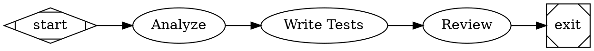

```bash
attractor run write-tests.dot
```

## 2. Implement-Validate Loop

A coding loop that retries implementation until tests pass.

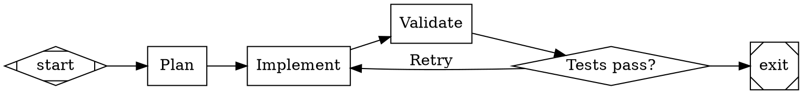

The `goal_gate=true` on `implement` means the pipeline cannot exit until implementation succeeds. If validation fails, the conditional routes back to `implement`.

## 3. Human Approval Gate

Pause for human review before proceeding.

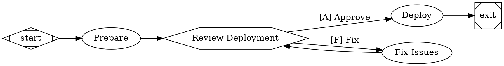

The human sees:

```
[?] Review Deployment
  [A] Approve
  [F] Fix
Select:
```

Pressing `A` proceeds to deploy; pressing `F` loops through fixes.

## 4. Parameterized Pipeline

Use variables to make pipelines reusable.

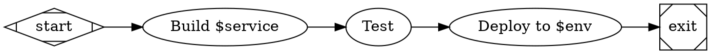

```bash
# Uses defaults: env=staging, region=us-east-1
attractor run deploy.dot --set service=api

# Override all variables
attractor run deploy.dot --set service=api --set env=production --set region=eu-west-1
```

## 5. Multi-Model Pipeline

Use different LLM models for different stages via the model stylesheet.

```dot
digraph MultiModel {
    graph [
        goal="Implement with specialized models",
        model_stylesheet="
            * { llm_model: claude-sonnet-4-5; llm_provider: anthropic; }
            .code { llm_model: claude-opus-4-6; reasoning_effort: high; }
            .fast { llm_model: claude-haiku-4-5; reasoning_effort: low; }
        "
    ]
    rankdir=LR

    start [shape=Mdiamond]
    exit  [shape=Msquare]

    plan      [label="Plan", class="fast", prompt="Outline the approach"]
    implement [label="Implement", class="code", prompt="Write the implementation"]
    review    [label="Review", class="code", prompt="Review for correctness"]
    summarize [label="Summarize", class="fast", prompt="Write a summary of changes"]

    start -> plan -> implement -> review -> summarize -> exit
}
```

- `plan` and `summarize` use Haiku (fast, cheap).
- `implement` and `review` use Opus (capable, thorough).

## 6. Retry with Backoff

Automatically retry flaky stages.

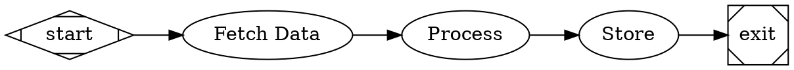

`fetch` retries up to 3 additional times (4 total) with exponential backoff. `process` retries once.

## 7. Goal Gate with Retry Target

Ensure a critical stage succeeds, routing back to an earlier stage if it hasn't by exit time.

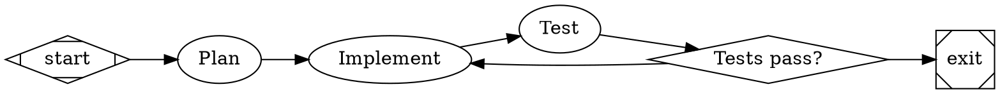

If the pipeline reaches `exit` but `test` hasn't recorded a SUCCESS, the engine jumps back to `implement` instead of exiting.

## 8. External Tool Execution

Run shell commands as pipeline stages.

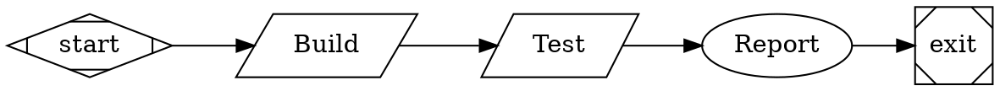

Tool nodes use `shape=parallelogram` and the `tool_command` attribute.

## 9. Shared Context Between Stages

Use `full` fidelity and `thread_id` to keep LLM conversation context across stages.

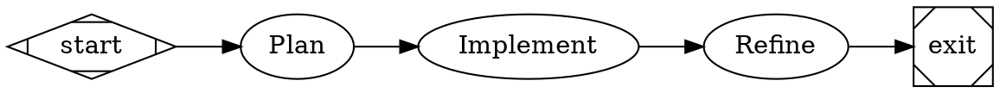

All three stages share the same LLM session (`thread_id="main"`), so `implement` sees the plan and `refine` sees both.

With a subgraph, this is cleaner:

```dot
subgraph cluster_dev {
    label = "Development"
    node [fidelity="full", thread_id="dev"]

    plan      [label="Plan", prompt="Plan the approach"]
    implement [label="Implement", prompt="Now implement the plan"]
    refine    [label="Refine", prompt="Improve the implementation"]
}
```

## 10. Prompt Files

Keep large prompts in separate files.

```
workflows/
    build.dot
    prompts/
        plan.md
        implement.md
        review.md
```

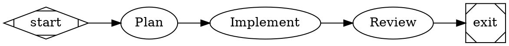

`@` paths are relative to the DOT file's directory.

## 11. Reusable Commands

Store prompt templates in `.attractor/commands/` and reference them with `/command`.

```
.attractor/
    commands/
        implement.md
        review.md
        my/
            careful-review.md
```

`.attractor/commands/implement.md`:
```markdown
Implement the following feature: $goal

Requirements:
- Write clean, tested code
- Follow existing patterns in the codebase
- Priority: $priority
```

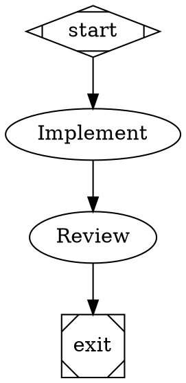

## 12. Branching with Human Triage

Use a human gate to route work to different paths.

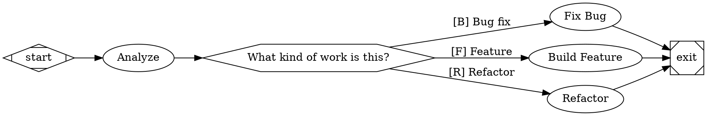

The human reads the analysis summary and chooses how to route. For fully automated branching, use outcome-based conditions:

```dot
// Route on outcome status (available after every node)
gate -> next  [condition="outcome=success"]
gate -> retry [condition="outcome=fail"]

// Route on tool output (available after parallelogram nodes)
test -> pass [condition="tool.output contains \"PASS\""]
test -> fail [condition="tool.output contains \"FAIL\""]

// Use weights for priority fallbacks (no conditions needed)
route -> preferred [weight=10]
route -> fallback  [weight=1]
```

Context keys are a fixed set determined by the handlers -- see the language spec for the complete list. You cannot set arbitrary context keys from the DOT file or via LLM responses.

## 13. Simulation Mode

Test pipeline structure without making LLM calls.

```bash
# Validate the graph structure
attractor validate workflow.dot

# Run with simulated LLM responses
attractor run workflow.dot --simulate

# Simulate with verbose output to see every event
attractor run workflow.dot --simulate --verbose
```

Simulation mode replaces LLM calls with `[Simulated] Response for stage: {node_id}`. The pipeline executes normally otherwise -- edge conditions are evaluated, human gates are presented (unless `--auto-approve`), and checkpoints are saved.

## 14. CI/CD Integration

Run pipelines in automated environments.

```bash
# Fully automated: no human interaction, simulated LLM
attractor run workflow.dot --simulate --auto-approve

# With real LLM but auto-approved gates
attractor run workflow.dot --auto-approve --logs-dir ./ci-logs/$BUILD_ID

# Validate in CI before merge
attractor validate workflow.dot || exit 1
```

## 15. Combining Patterns

A production-grade pipeline combining multiple techniques.

```dot
digraph ProductionPipeline {
    graph [
        goal="Implement $feature with full validation",
        vars="feature, branch=main, test_cmd=npm test",
        model_stylesheet="
            * { llm_model: claude-sonnet-4-5; llm_provider: anthropic; }
            .heavy { llm_model: claude-opus-4-6; reasoning_effort: high; }
            .fast { llm_model: claude-haiku-4-5; reasoning_effort: low; }
        "
    ]
    rankdir=LR

    start [shape=Mdiamond]
    exit  [shape=Msquare]

    // Planning phase (fast model)
    plan [label="Plan", class="fast", prompt="@prompts/plan.md"]

    // Implementation phase (heavy model, shared context)
    subgraph cluster_impl {
        label = "Implementation"
        node [fidelity="full", thread_id="impl", class="heavy"]

        implement [label="Implement", prompt="@prompts/implement.md", goal_gate=true]
        refine    [label="Refine", prompt="Refine based on test results"]
    }

    // Validation
    run_tests [shape=parallelogram, label="Run Tests", tool_command="$test_cmd"]
    check     [shape=diamond, label="Tests pass?"]

    // Human review
    review [shape=hexagon, label="Review Changes"]
    fixup  [label="Fix Issues", class="heavy", prompt="Address review feedback"]

    // Summary (fast model)
    summarize [label="Summarize", class="fast", prompt="Write a changelog entry"]

    start -> plan -> implement -> run_tests -> check
    check -> review       [condition="outcome=success"]
    check -> refine       [condition="outcome!=success"]
    refine -> run_tests

    review -> summarize [label="[A] Approve"]
    review -> fixup     [label="[F] Fix"]
    fixup -> review

    summarize -> exit
}
```

```bash
attractor run production.dot --set feature="user-authentication" --set test_cmd="pytest -x"
```
