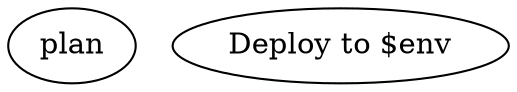

# Attractor DOT Language Specification

Attractor uses a strict subset of the Graphviz DOT language to define AI workflow pipelines. Each `.dot` file describes a directed graph where nodes are tasks and edges are transitions.

## Grammar

```
Graph           ::= 'digraph' Identifier '{' Statement* '}'

Statement       ::= GraphAttrStmt
                   | NodeDefaults
                   | EdgeDefaults
                   | SubgraphStmt
                   | NodeStmt
                   | EdgeStmt
                   | GraphAttrDecl

GraphAttrStmt   ::= 'graph' AttrBlock ';'?
NodeDefaults    ::= 'node' AttrBlock ';'?
EdgeDefaults    ::= 'edge' AttrBlock ';'?
GraphAttrDecl   ::= Identifier '=' Value ';'?

SubgraphStmt    ::= 'subgraph' Identifier? '{' Statement* '}'

NodeStmt        ::= Identifier AttrBlock? ';'?
EdgeStmt        ::= Identifier ( '->' Identifier )+ AttrBlock? ';'?

AttrBlock       ::= '[' Attr ( ',' Attr )* ']'
Attr            ::= Key '=' Value

Key             ::= Identifier | QualifiedId
QualifiedId     ::= Identifier ( '.' Identifier )+

Value           ::= String | Integer | Float | Boolean | Duration
Identifier      ::= [A-Za-z_][A-Za-z0-9_]*
String          ::= '"' ( '\\"' | '\\n' | '\\t' | '\\\\' | [^"\\] )* '"'
Integer         ::= '-'? [0-9]+
Float           ::= '-'? [0-9]* '.' [0-9]+
Boolean         ::= 'true' | 'false'
Duration        ::= Integer ( 'ms' | 's' | 'm' | 'h' | 'd' )
```

## Constraints

- **One digraph per file.** No multiple graphs, undirected graphs, or `strict` modifiers.
- **Bare identifiers for node IDs.** Must match `[A-Za-z_][A-Za-z0-9_]*`. Use `label` for display names.
- **Commas required between attributes.** `[shape=box, timeout="900s"]`, not `[shape=box timeout="900s"]`.
- **Directed edges only.** Use `->`. The `--` operator is rejected.
- **Comments.** Both `// line` and `/* block */` styles are supported.
- **Semicolons optional.** Accepted but not required.

## Value Types

| Type     | Syntax                    | Examples                          |
|----------|---------------------------|-----------------------------------|
| String   | Double-quoted with escapes | `"Hello world"`, `"line1\nline2"` |
| Integer  | Optional sign, digits      | `42`, `-1`, `0`                   |
| Float    | Decimal number             | `0.5`, `-3.14`                    |
| Boolean  | Literal keywords           | `true`, `false`                   |
| Duration | Integer + unit suffix      | `900s`, `15m`, `2h`, `250ms`, `1d` |

## Graph Attributes

Declared in a `graph [ ... ]` block or as top-level `key = value` declarations.

| Key                       | Type     | Default   | Description |
|---------------------------|----------|-----------|-------------|
| `goal`                    | String   | `""`      | Pipeline goal. Exposed as `$goal` in prompts. |
| `label`                   | String   | `""`      | Display name for the graph. |
| `vars`                    | String   | `""`      | Comma-separated variable declarations with optional defaults. Format: `"name1, name2=default_value"`. |
| `model_stylesheet`        | String   | `""`      | CSS-like stylesheet for per-node LLM configuration. |
| `default_max_retry`       | Integer  | `50`      | Global retry ceiling for nodes that omit `max_retries`. |
| `retry_target`            | String   | `""`      | Node ID to jump to on unsatisfied goal gates at exit. |
| `fallback_retry_target`   | String   | `""`      | Secondary jump target. |
| `default_fidelity`        | String   | `""`      | Default context fidelity mode. |

## Node Attributes

| Key                     | Type     | Default       | Description |
|-------------------------|----------|---------------|-------------|
| `label`                 | String   | node ID       | Display name. |
| `shape`                 | String   | `"box"`       | Determines handler type (see shape mapping). |
| `type`                  | String   | `""`          | Explicit handler type override. Takes precedence over shape. |
| `prompt`                | String   | `""`          | Primary instruction. Supports inline text, `@path` file include, or `/command` lookup. Supports `$variable` expansion. Falls back to `label` for LLM stages. |
| `max_retries`           | Integer  | `0`           | Additional retry attempts beyond the initial execution. |
| `goal_gate`             | Boolean  | `false`       | Must succeed before pipeline can exit. |
| `retry_target`          | String   | `""`          | Node ID to jump to on failure. |
| `fallback_retry_target` | String   | `""`          | Secondary jump target. |
| `fidelity`              | String   | inherited     | Context fidelity mode for LLM session. |
| `thread_id`             | String   | derived       | Thread identifier for LLM session reuse. |
| `class`                 | String   | `""`          | Comma-separated class names for stylesheet targeting. |
| `timeout`               | Duration | unset         | Maximum execution time. |
| `llm_model`             | String   | inherited     | LLM model identifier. |
| `llm_provider`          | String   | auto-detected | LLM provider key. |
| `reasoning_effort`      | String   | `"high"`      | Reasoning depth: `low`, `medium`, `high`. |
| `auto_status`           | Boolean  | `false`       | Auto-generate SUCCESS if handler writes no status. |
| `allow_partial`         | Boolean  | `false`       | Accept PARTIAL_SUCCESS when retries are exhausted. |

## Edge Attributes

| Key            | Type     | Default | Description |
|----------------|----------|---------|-------------|
| `label`        | String   | `""`    | Display caption and routing key. |
| `condition`    | String   | `""`    | Boolean guard expression. |
| `weight`       | Integer  | `0`     | Priority for edge selection (higher wins). |
| `fidelity`     | String   | unset   | Override fidelity for the target node. |
| `thread_id`    | String   | unset   | Override thread ID for the target node. |
| `loop_restart` | Boolean  | `false` | Terminate current run and re-launch with fresh log directory. |

## Shape-to-Handler Mapping

The `shape` attribute determines which handler executes the node, unless overridden by `type`.

| Shape             | Handler Type          | Description |
|-------------------|-----------------------|-------------|
| `Mdiamond`        | `start`               | Pipeline entry point. No-op. Exactly one required. |
| `Msquare`         | `exit`                | Pipeline exit point. No-op. Exactly one required. |
| `box`             | `codergen`            | LLM task. Default for all nodes. |
| `hexagon`         | `wait.human`          | Human-in-the-loop gate. Blocks until human selects. |
| `diamond`         | `conditional`         | Routing point. Engine evaluates edge conditions. |
| `component`       | `parallel`            | Parallel fan-out. Concurrent branch execution. |
| `tripleoctagon`   | `parallel.fan_in`     | Parallel fan-in. Consolidates branch results. |
| `parallelogram`   | `tool`                | External tool execution. |
| `house`           | `stack.manager_loop`  | Supervisor loop over child pipeline. |

## Chained Edges

Chained declarations are syntactic sugar:

```dot
A -> B -> C [label="next"]
```

Expands to:

```dot
A -> B [label="next"]
B -> C [label="next"]
```

Attributes apply to every edge in the chain.

## Subgraphs

Subgraphs scope defaults and derive stylesheet classes.

```dot
subgraph cluster_loop {
    label = "Loop A"
    node [thread_id="loop-a", timeout="900s"]

    Plan      [label="Plan next step"]
    Implement [label="Implement", timeout="1800s"]
}
```

- `Plan` inherits `thread_id="loop-a"` and `timeout="900s"`.
- `Implement` inherits `thread_id` but overrides `timeout`.
- Both receive the derived class `loop-a` (from the subgraph label).

Class derivation: lowercase the label, replace spaces with hyphens, strip non-alphanumeric characters except hyphens.

## Prompt Resolution

The `prompt` attribute supports three forms:

| Prefix | Form           | Resolution |
|--------|----------------|------------|
| `@`    | File include   | Read file relative to DOT file directory. |
| `/`    | Command lookup | Search for `{name}.md` in `.attractor/commands/` path. Colons become directory separators. |
| (none) | Inline text    | Used as-is. |

Examples:

```dot
// Inline
plan [prompt="Plan the implementation of $feature"]

// File include
plan [prompt="@prompts/plan.md"]

// Command lookup (searches .attractor/commands/rfc-to-plan.md)
plan [prompt="/rfc-to-plan RFC-006"]

// Namespaced command (searches my/careful-review.md)
review [prompt="/my:careful-review"]
```

The search path for `/command` lookups:
1. DOT file directory
2. `{project}/.attractor/commands/`
3. `~/.attractor/commands/`
4. Directories in `ATTRACTOR_COMMANDS_PATH` (comma-separated)

## Variable Expansion

Variables declared in `graph[vars]` are expanded as `$name` in `prompt`, `label`, `tool_command`, `pre_hook`, and `post_hook` attributes.



- `$goal` is implicitly declared when `graph[goal]` is set. Available in DOT attributes and command files.
- `$ARGUMENTS` is available only inside `/command` `.md` files, not in the DOT file itself. Its value comes from the text after the command name in the `prompt` attribute (e.g., `prompt="/rfc-to-plan RFC-006"` sets `$ARGUMENTS` to `RFC-006`).
- Runtime overrides via `--set key=value` take precedence over defaults.

## Condition Expression Language

Edge conditions use a boolean expression language:

```
ConditionExpr  ::= AndGroup ( '||' AndGroup )*
AndGroup       ::= Clause ( '&&' Clause )*
Clause         ::= '!'? Key Operator Value
                 | '!'? Key                    -- bare key (truthy check)
Key            ::= 'outcome' | 'preferred_label' | 'context.' Path | Identifier
Operator       ::= '=' | '!=' | 'contains' | 'matches' | '<' | '>' | '<=' | '>='
```

**Operators:**

| Operator   | Description |
|------------|-------------|
| `=`        | Exact string equality. |
| `!=`       | String inequality. |
| `contains` | Substring check (`String.includes()`). |
| `matches`  | Regex match (`RegExp.test()`). |
| `<` `>` `<=` `>=` | Numeric comparison. NaN on either side yields false. |

**Logical connectives:**

- `&&` (AND) binds tighter than `||` (OR).
- `!` prefix negates a clause. Distinct from `!=`.
- No parenthesized grouping.

**Variable resolution:**

- `outcome` -- the current node's outcome status.
- `preferred_label` -- the outcome's preferred edge label.
- `context.*` -- context key lookup (also tries without prefix).
- Bare identifiers -- direct context lookup.
- Missing keys resolve to empty string.

**Examples:**

```dot
// Equality / inequality
gate -> exit  [condition="outcome=success"]
gate -> retry [condition="outcome!=success"]

// AND: outcome succeeded and tool output confirms
gate -> deploy [condition="outcome=success && tool.output contains \"PASS\""]

// OR: accept multiple outcome values
gate -> next [condition="outcome=success || outcome=partial_success"]

// NOT: negate a clause
gate -> skip [condition="!outcome=fail"]

// contains: substring in tool output
check -> handle_err [condition="tool.output contains \"ERROR\""]

// matches: regex on LLM response
check -> legacy [condition="last_response matches \"version 1\\.\""]

// Numeric comparison: retry budget
check -> give_up [condition="internal.retry_count.implement >= 5"]
```

## Context Fidelity

Controls how much prior state is carried into the next node's LLM session.

| Mode             | Session | Description |
|------------------|---------|-------------|
| `full`           | Reused  | Full conversation history preserved. |
| `truncate`       | Fresh   | Minimal: only graph goal and run ID. |
| `compact`        | Fresh   | Structured bullet-point summary (default). |
| `summary:low`    | Fresh   | Brief summary (~600 tokens). |
| `summary:medium` | Fresh   | Moderate detail (~1500 tokens). |
| `summary:high`   | Fresh   | Detailed summary (~3000 tokens). |

Resolution precedence (highest to lowest):
1. Edge `fidelity` attribute
2. Target node `fidelity` attribute
3. Graph `default_fidelity` attribute
4. Default: `compact`

## Model Stylesheet

Centralize LLM configuration with CSS-like rules in `graph[model_stylesheet]`.

```
Selector  ::= '*' | '#' Identifier | '.' ClassName
Property  ::= 'llm_model' | 'llm_provider' | 'reasoning_effort'
```

| Selector      | Matches             | Specificity |
|---------------|---------------------|-------------|
| `*`           | All nodes           | 0 (lowest)  |
| `.class_name` | Nodes with class    | 1 (medium)  |
| `#node_id`    | Specific node by ID | 2 (highest) |

Explicit node attributes always override stylesheet values.

```dot
graph [
    model_stylesheet="
        * { llm_model: claude-sonnet-4-5; llm_provider: anthropic; }
        .code { llm_model: claude-opus-4-6; }
        #critical_review { llm_model: gpt-5.2; llm_provider: openai; reasoning_effort: high; }
    "
]
```

## Handler-Specific Node Attributes

Some handlers read additional node attributes beyond the common set.

### Parallel Handler (`shape=component`)

| Key             | Type    | Default      | Description |
|-----------------|---------|--------------|-------------|
| `join_policy`   | String  | `"wait_all"` | When to consider the parallel block done. |
| `error_policy`  | String  | `"continue"` | How to handle branch failures. |
| `max_parallel`  | Integer | `4`          | Maximum concurrent branches. |
| `join_k`        | Integer | unset        | K value for `k_of_n` join policy. |
| `join_quorum`   | Float   | unset        | Fraction for `quorum` join policy. |

**Join policies:** `wait_all`, `k_of_n`, `first_success`, `quorum`.

**Error policies:** `fail_fast` (cancel remaining on first failure), `continue` (run all branches), `ignore` (ignore failures).

### Human Gate (`shape=hexagon`)

| Key                    | Type   | Default | Description |
|------------------------|--------|---------|-------------|
| `human.default_choice` | String | `""`    | Edge target to select on timeout (when no human responds). |

### Tool Handler (`shape=parallelogram`)

| Key            | Type   | Default | Description |
|----------------|--------|---------|-------------|
| `tool_command` | String | `""`    | Shell command to execute. |
| `pre_hook`     | String | `""`    | Shell command to run before tool execution. |
| `post_hook`    | String | `""`    | Shell command to run after tool execution. |

### Manager Loop Handler (`shape=house`)

| Key                       | Type     | Default          | Description |
|---------------------------|----------|------------------|-------------|
| `manager.max_cycles`      | Integer  | `1000`           | Maximum observation cycles. |
| `manager.poll_interval`   | Duration | `"45s"`          | Time between observation cycles. |
| `manager.stop_condition`  | String   | `""`             | Condition expression to evaluate for early exit. |
| `manager.actions`         | String   | `"observe,wait"` | Comma-separated actions per cycle: `observe`, `steer`, `wait`. |
| `manager.steer_cooldown_ms` | Integer | unset          | Minimum time between steer actions. |
| `stack.child_dotfile`     | String   | `""`             | Path to the child pipeline DOT file (graph-level). |
| `stack.child_autostart`   | String   | `"true"`         | Auto-start the child pipeline. |

## Context Keys Reference

During execution, the pipeline engine maintains a key-value context that handlers read from and write to. Understanding these keys is essential for writing edge conditions and understanding pipeline state.

### Engine-Set Keys

These are set automatically by the execution engine.

| Key | Type | Description |
|-----|------|-------------|
| `graph.goal` | String | Mirrored from `graph[goal]` at initialization. |
| `current_node` | String | ID of the currently executing node. |
| `outcome` | String | Last handler's outcome status: `success`, `fail`, `partial_success`, `retry`, `skipped`. |
| `preferred_label` | String | Last handler's preferred edge label (if any). |
| `internal.retry_count.<node_id>` | Integer | Retry counter for a specific node (e.g., `internal.retry_count.implement`). |
| `internal.incoming_edge_fidelity` | String | Fidelity mode from the incoming edge (for handler use). |
| `internal.incoming_edge_thread_id` | String | Thread ID from the incoming edge (for handler use). |
| `internal.effective_fidelity` | String | Resolved fidelity mode for the current node. |
| `internal.thread_key` | String | Resolved thread key for LLM session reuse. |

### Handler-Set Keys

These are set by specific handlers via `context_updates` in their Outcome.

**Codergen handler** (LLM tasks, `shape=box`):

| Key | Type | Description |
|-----|------|-------------|
| `last_stage` | String | Node ID of the last completed LLM stage. |
| `last_response` | String | First 200 characters of the LLM response. |

**Wait for human handler** (`shape=hexagon`):

| Key | Type | Description |
|-----|------|-------------|
| `human.gate.selected` | String | Accelerator key of the selected choice. |
| `human.gate.label` | String | Full label of the selected choice. |

**Tool handler** (`shape=parallelogram`):

| Key | Type | Description |
|-----|------|-------------|
| `tool.output` | String | stdout from the executed command. |

**Parallel handler** (`shape=component`):

| Key | Type | Description |
|-----|------|-------------|
| `parallel.results` | String | JSON-stringified array of branch Outcome objects. |

**Fan-in handler** (`shape=tripleoctagon`):

| Key | Type | Description |
|-----|------|-------------|
| `parallel.fan_in.best_outcome` | String | Status of the best candidate. |
| `parallel.fan_in.llm_evaluation` | String | LLM evaluation results (when prompt-based selection is used). |

**Manager loop handler** (`shape=house`):

| Key | Type | Description |
|-----|------|-------------|
| `manager.current_cycle` | Integer | Current observation cycle number. |
| `manager.final_cycle` | Integer | Cycle number when the loop completed. |
| `stack.child.status` | String | Child pipeline status: `completed`, `failed`. |
| `stack.child.outcome` | String | Child pipeline outcome. |

### What You Can Route On

These are the context keys available for use in edge conditions. This is a closed set -- pipeline authors cannot set arbitrary context keys from the DOT file or via LLM responses. The keys below are the complete set produced by the built-in handlers and engine.

**Outcome routing** (available after every node):

```dot
gate -> next [condition="outcome=success"]
gate -> fix  [condition="outcome=fail"]
gate -> next [condition="outcome=success || outcome=partial_success"]
gate -> skip [condition="!outcome=fail"]
```

**Human gate routing** (available after `shape=hexagon` nodes):

```dot
// Route on the accelerator key the human pressed
gate -> deploy [condition="human.gate.selected=A"]
gate -> fix    [condition="human.gate.selected=F"]

// Route on the full label text
gate -> deploy [condition="human.gate.label contains \"Approve\""]
```

**Tool output routing** (available after `shape=parallelogram` nodes):

```dot
check -> pass [condition="tool.output contains \"PASS\""]
check -> fail [condition="tool.output contains \"FAIL\""]
```

**LLM response routing** (available after `shape=box` nodes):

```dot
// last_response contains the first 200 characters of the LLM's text output
check -> error_path [condition="last_response contains \"ERROR\""]
```

**Retry count routing:**

```dot
// internal.retry_count.<node_id> tracks how many times a node has been retried
check -> give_up [condition="internal.retry_count.implement >= 3"]
```

**Manager/supervisor routing** (available inside `shape=house` loops):

```dot
check -> done [condition="stack.child.status=completed"]
check -> fail [condition="stack.child.status=failed"]
```

**Graph goal:**

```dot
// graph.goal is mirrored from graph[goal] at initialization
check -> skip [condition="graph.goal contains \"optional\""]
```

Note: `outcome` and `preferred_label` are the primary routing mechanisms for most pipelines. The other keys are useful for specific handler types. Conditions on LLM response content (`last_response`) are limited to the first 200 characters.

### Namespace Conventions

| Prefix        | Source | Description |
|---------------|--------|-------------|
| `graph.*`     | Engine | Graph attributes mirrored at initialization. |
| `internal.*`  | Engine | Retry counters, fidelity, thread keys. Not intended for user conditions. |
| `human.gate.*` | Wait for human handler | Human selection state. |
| `parallel.*`  | Parallel/fan-in handlers | Branch results and evaluation. |
| `stack.*`     | Manager loop handler | Child pipeline state. |
| `manager.*`   | Manager loop handler | Observation cycle state. |
| `tool.*`      | Tool handler | Command output. |
| (no prefix)   | Engine/codergen | `outcome`, `preferred_label`, `last_stage`, `last_response`, `current_node`. |

## Validation Rules

| Rule                    | Severity | Description |
|-------------------------|----------|-------------|
| `start_node`            | ERROR    | Exactly one start node (shape=Mdiamond) required. |
| `terminal_node`         | ERROR    | At least one exit node (shape=Msquare) required. |
| `reachability`          | ERROR    | All nodes must be reachable from start. |
| `edge_target_exists`    | ERROR    | Edge targets must reference existing nodes. |
| `start_no_incoming`     | ERROR    | Start node must have no incoming edges. |
| `exit_no_outgoing`      | ERROR    | Exit node must have no outgoing edges. |
| `condition_syntax`      | ERROR    | Edge conditions must parse correctly. |
| `stylesheet_syntax`     | ERROR    | Model stylesheet must parse correctly. |
| `vars_declared`         | ERROR    | All `$variable` references must be declared in `vars`. |
| `prompt_file_exists`    | ERROR    | `@path` prompt files must exist. |
| `prompt_command_exists` | ERROR    | `/command` prompts must resolve. |
| `type_known`            | WARNING  | Node `type` values should be recognized. |
| `fidelity_valid`        | WARNING  | Fidelity values must be valid modes. |
| `retry_target_exists`   | WARNING  | Retry targets must reference existing nodes. |
| `goal_gate_has_retry`   | WARNING  | Goal gate nodes should have retry targets. |
| `prompt_on_llm_nodes`   | WARNING  | Codergen nodes should have a `prompt` or `label`. |
